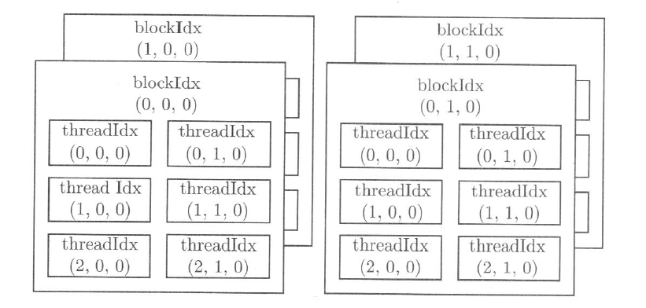

## CUDA 中的  Hello Word 程序

CUDA 程序通常由以下两个部分组成：

- 主机代码（Host Code）：运行在 CPU 上的代码，负责整体的程序流程控制，数据的预处理和后处理，以及与 GPU 的交互
- 设备代码（Device Code）：运行在 GPU 上的代码，通常是通过核函数（Kernel Functions）实现的并行计算部分

CUDA 核函数的一般特点:

- 并行执行：核函数可以被成千上万的线程同时执行，每个线程处理不同的数据
- 定义方式：核函数需要使用 `__global__` 关键字进行定义，表明它可以在设备上执行
- 返回类型：核函数的返回类型必须是 `void`，即核函数不能返回任何值
- 执行配置：核函数的执行需要指定执行配置，例如：`<<<线程网格大小, 线程块大小>>>`

```
#include <cstdio>

__global__ void hello_world(){
	printf("hello world from gpu.\n");
}

int main()
{
	hello_world<<<1,1>>>();
	cudaDeviceSynchronize();

	return 0;
}
```

- `cudaDeviceSynchronize()` 是 CUDA 运行时 API 中的一个函数，其作用是同步主机和设备的执行，在 CUDA 编程中，很多操作（如内存复制、核函数执行等）是异步执行的。这意味着主机代码发出命令后，不必等待这些命令完成就可以继续执行。`cudaDeviceSynchronize()` 函数确保在它之前的所有命令都已经在设备上执行完毕
- CUDA 核函数不支持 C++ `iostream`，这里使用 `printf`

## CUDA 中的线程组织

### 使用多个线程的核函数

一个 GPU 往往有几千个计算核心，而总的线程数必须至少等于计算核心数时才有可能充分利用 GPU 中的全部计算资源。实际上，总的线程数大于计算核心数时才能更充分地利用 GPU 中的计算资源，因为这会让计算和内存访问之间及不同的计算之间合理地重叠，从而减小计算核心空闲的时间。

CUDA 核函数启动的线程数可以通过执行配置更改：
```
hello_world<<<2,4>>>();
```
- 2 表示网格大小，即线程块的个数，这里是 2，4 表示线程块大小，即每个线程块中的线程数，这里是 4，总的线程数是通过网格大小乘以每个线程块的大小来计算的，即 `2 * 4 = 8`。这意味着 `hello_world` 核函数将使用 8 个 CUDA 线程来执行
- 

### 使用线程索引

CUDA 核函数的执行配置: `<<<grid_size, block_size>>>`

- `grid_size`、`block_size` 一般来说是一个结构体类型的变量，但也可以是一个普通的整型变量
- 从开普勒架构开始，最大允许的线程块大小是 `1024`，而最大允许的网格大小是 `2^31-1`（针对这里的一维网格来说），所以，用上述简单的执行配置时最多可以指派大约两万亿个线程。这通常是远大于一般的编程问题中常用的线程数的
- 一般来说，只要线程数比GPU中的计算核心数（几百至几千个）多几倍时，就有可能充分地利用GPU中的全部计算资源


每个线程在核函数中都有一个唯一的身份标识。由于我们用两个参数指定了线程数目，那么自然地，每个线程的身份可由两个参数确定。在核函数内部，程序是知道执行配置参数 `grid_size` 和 `block_size` 的值，这两个值分别保存于如下的内建变量中：

- `gridDim.x`：该变量的数值等于执行配置中变量 `grid_size` 的数值
- `blockDim.x`：该变量的数值等于执行配置中变量 `block_size` 的数值

类似地，在核函数中预定义了如下标识线程的内建变量：

- `blockIdx.x`：该变量指定一个线程在一个网格中的线程块指标，其取值范围是从 `0` 到 `gridDim.x-1`
- `threadIdx.x`：该变量指定一个线程在一个线程块中的线程指标，其取值范围是从 `0` 到 `blockDim.x-1`

可以在 `hello_word` 程序中打印出 `blockId` 和 `threadId`:

```
#include <cstdio>

__global__ void hello_world(){
	int bid = blockIdx.x;
	int tid = threadIdx.x;
	printf("hello world from block:%d and thread:%d.\n", bid, tid);
}

int main()
{
	hello_world<<<2,4>>>();
	cudaDeviceSynchronize();

	return 0;
}
```

### 多维线程网格

- `blockIdx` 和 `threadIdx` 是类型为 `uint3` 的变量。该类型是一个结构体，具有 `x`、`y`、`z` 这三个成员：
```
// vector_types.h
struct __device_builtin__ uint3 {
    unsigned int x, y, z;
};
typedef __device_builtin__ struct uint3 uint3;
```

- `gridDim` 和 `blockDim` 是类型为 `dim3` 的变量。该类型是一个结构体，具有 `x`、`y`、`z` 这三个成员


这些内建变量都只在核函数中有效（可见），并且满足如下关系：

- `blockIdx.x` 的取值范围是从 `0` 到 `gridDim.x-1`
- `blockIdx.y` 的取值范围是从 `0` 到 `gridDim.y-1`
- `blockIdx.z` 的取值范围是从 `0` 到 `gridDim.z-1`
- `threadIdx.x` 的取值范围是从 `0` 到 `blockDim.x-1`
- `threadIdx.y` 的取值范围是从 `0` 到 `blockDim.y-1`
- `threadIdx.z` 的取值范围是从 `0` 到 `blockDim.z-1`

前面的执行配置: `<<<grid_size, block_size>>>` 仅仅使用了两个整数，这两个整数的值将分别赋给内建变量 `gridDim.x` 和 `blockDim.x`。此时，`gridDim` 和 `blockDim` 中没有被指定的成员取默认值 `1`。在这种情况下，网格和线程块实际上都是“一维”的。

也可以用结构体 `dim3` 定义多维的网格和线程块:
```
dim3 grid_size(Gx, Gy, Gz);
dim3 block_size(Bx, By, Bz);
```

如果第三个维度的大小是1，则可以写为：
```
dim3 grid_size(Gx, Gy);
dim3 block_size(Bx, By);
```

例如定义:
```
dim3 grid_size(2, 2);
dim3 block_size(3, 2);
```

说明有 `2 * 2` 个线程块，每个线程块中有 `3 * 2 * 1` 个线程，如下图所示:




多维的网格和线程块本质上还是一维的，就像多维数组本质上也是一维数组一样。

全局线程索引计算方式为:
```
int tid=threadIdx.z×blockDim.x×blockDim.y+threadIdx.y×blockDim.x+threadIdx.x;
```
- 也就是说，`x` 维度是最内层的（变化最快），而 `z` 维度是最外层的（变化最慢）


全局线程块索引计算方式为:
```
int bid=blockIdx.z×gridDim.x×gridDim.y+blockIdx.y×gridDim.x+blockIdx.x;
```

有时也会用到复合形式的线程索引:
```
int nx=blockDim.x×blockIdx.x+threadIdx.x;
int ny=blockDim.y×blockIdx.y+threadIdx.y;
int nz=blockDim.z×blockIdx.z+threadIdx.z;
```

### 线程束


