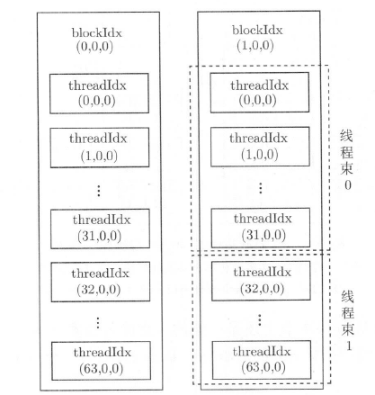

## CUDA 中的  Hello Word 程序

CUDA 程序通常由以下两个部分组成：

- 主机代码（Host Code）：运行在 CPU 上的代码，负责整体的程序流程控制，数据的预处理和后处理，以及与 GPU 的交互
- 设备代码（Device Code）：运行在 GPU 上的代码，通常是通过核函数（Kernel Functions）实现的并行计算部分

CUDA 核函数的定义需要使用 `__global__`，调用时需要指定执行配置 `<<<线程网格大小, 线程块大小>>>`，返回值必须是 `void` 类型


```
#include <cstdio>

__global__ void hello_world(){
	printf("hello world from gpu.\n");
}

int main()
{
	hello_world<<<1,1>>>();
	cudaDeviceSynchronize();

	return 0;
}
```

- `cudaDeviceSynchronize()` 是 CUDA 运行时 API 中的一个函数，其作用是同步主机和设备的执行，在 CUDA 编程中，很多操作（如内存复制、核函数执行等）是异步执行的。这意味着主机代码发出命令后，不必等待这些命令完成就可以继续执行。`cudaDeviceSynchronize()` 函数确保在它之前的所有命令都已经在设备上执行完毕
- CUDA 核函数不支持 C++ `iostream`，这里使用 `printf`

## CUDA 中的线程组织

### 使用多个线程的核函数

一个 GPU 往往有几千个计算核心，而总的线程数必须至少等于计算核心数时才有可能充分利用 GPU 中的全部计算资源。实际上，总的线程数大于计算核心数时才能更充分地利用 GPU 中的计算资源，因为这会让计算和内存访问之间及不同的计算之间合理地重叠，从而减小计算核心空闲的时间。

CUDA 核函数启动的线程数可以通过执行配置更改：
```
hello_world<<<2,4>>>();
```
- 2 表示网格大小，即线程块的个数，这里是 2，4 表示线程块大小，即每个线程块中的线程数，这里是 4，总的线程数是通过网格大小乘以每个线程块的大小来计算的，即 `2 * 4 = 8`。这意味着 `hello_world` 核函数将使用 8 个 CUDA 线程来执行
- 

### CUDA 中的线程组织


- 基本关系是 `Thread` 在一起组成了 `Block`，`Block` 在一起组成了 `Grid`
- 线程是 CUDA 编程中的最小单位，实际上线程分块是逻辑上的划分，在物理上线程不分块
- CUDA 中对能够定义的网格大小和线程块大小做了限制，从开普勒架构开始：
	- 线程块大小在 `x`、`y` 和 `z` 这 3 个方向的最大允许值分别为 `1024`、`1024`和 `64`
	- 网格大小在 `x`、`y` 和 `z` 这 3 个方向的最大允许值分别为 `2^31-1`、`65535` 和 `65535`
	- 另外，还要求线程块总的大小，即 `blockDim.x * blockDim.y * blockDim.z` 不能大于 `1024`。也就是说，不管如何定义，一个线程块最多只能有 `1024` 个线程
- 在调用 GPU 的时候，核函数中是允许开很多线程的，开的线程个数可以远高于 GPU 计算核心的数量，一般来说，只要线程数比 GPU 中的计算核心数（几百至几千个）多几倍时，就有可能充分地利用 GPU 中的全部计算资源


### 使用线程索引

每个线程在核函数中都有一个唯一的身份标识。由于我们用两个参数指定了线程数目，那么自然地，每个线程的身份可由两个参数确定。在核函数内部，程序是知道执行配置参数 `grid_size` 和 `block_size` 的值，这两个值分别保存于如下的内建变量中：

- `gridDim.x`：该变量的数值等于执行配置中变量 `grid_size` 的数值
- `blockDim.x`：该变量的数值等于执行配置中变量 `block_size` 的数值

类似地，在核函数中预定义了如下标识线程的内建变量：

- `blockIdx.x`：该变量指定一个线程在一个网格中的线程块指标，其取值范围是从 `0` 到 `gridDim.x-1`
- `threadIdx.x`：该变量指定一个线程在一个线程块中的线程指标，其取值范围是从 `0` 到 `blockDim.x-1`

可以在 `hello_word` 程序中打印出 `blockId` 和 `threadId`:

```
#include <cstdio>

__global__ void hello_world(){
	int bid = blockIdx.x;
	int tid = threadIdx.x;
	int g_tid = blockIdx.x * blockDim.x +  threadIdx.x; // 0~7
	printf("hello world from block:%d and thread:%d with global thread id: %d.\n", bid, tid, g_tid);
}

int main()
{
	hello_world<<<2,4>>>();
	cudaDeviceSynchronize();

	return 0;
}
```

输出:
```
hello world from block:0 and thread:0 with global thread id: 0.
hello world from block:0 and thread:1 with global thread id: 1.
hello world from block:0 and thread:2 with global thread id: 2.
hello world from block:0 and thread:3 with global thread id: 3.
hello world from block:1 and thread:0 with global thread id: 4.
hello world from block:1 and thread:1 with global thread id: 5.
hello world from block:1 and thread:2 with global thread id: 6.
hello world from block:1 and thread:3 with global thread id: 7.
```

### 多维线程网格

- `blockIdx` 和 `threadIdx` 是类型为 `uint3` 的变量。该类型是一个结构体，具有 `x`、`y`、`z` 这三个成员：
```
// vector_types.h
struct __device_builtin__ uint3 {
    unsigned int x, y, z;
};
typedef __device_builtin__ struct uint3 uint3;
```

- `gridDim` 和 `blockDim` 是类型为 `dim3` 的变量。该类型是一个结构体，具有 `x`、`y`、`z` 这三个成员


这些内建变量都只在核函数中有效（可见），并且满足如下关系：

- `blockIdx.x` 的取值范围是从 `0` 到 `gridDim.x-1`
- `blockIdx.y` 的取值范围是从 `0` 到 `gridDim.y-1`
- `blockIdx.z` 的取值范围是从 `0` 到 `gridDim.z-1`
- `threadIdx.x` 的取值范围是从 `0` 到 `blockDim.x-1`
- `threadIdx.y` 的取值范围是从 `0` 到 `blockDim.y-1`
- `threadIdx.z` 的取值范围是从 `0` 到 `blockDim.z-1`

前面的执行配置: `<<<grid_size, block_size>>>` 仅仅使用了两个整数，这两个整数的值将分别赋给内建变量 `gridDim.x` 和 `blockDim.x`。此时，`gridDim` 和 `blockDim` 中没有被指定的成员取默认值 `1`。在这种情况下，网格和线程块实际上都是“一维”的。

也可以用结构体 `dim3` 定义多维的网格和线程块:
```
dim3 grid_size(Gx, Gy, Gz);
dim3 block_size(Bx, By, Bz);
```

如果第三个维度的大小是1，则可以写为：
```
dim3 grid_size(Gx, Gy);
dim3 block_size(Bx, By);
```

例如定义:
```
dim3 grid_size(2, 2);
dim3 block_size(3, 2);
```

说明有 `2 * 2` 个线程块，每个线程块中有 `3 * 2 * 1` 个线程，如下图所示:


多维的网格和线程块本质上还是一维的，就像多维数组本质上也是一维数组一样。


全局线程块索引计算方式为:
```
int bid = blockIdx.z * gridDim.x * gridDim.y + blockIdx.y * gridDim.x + blockIdx.x;
```

局部线程索引计算方式为:
```
int tid = threadIdx.z * blockDim.x * blockDim.y + threadIdx.y * blockDim.x + threadIdx.x;
```

全局线程索引的计算方式为:
```
int id = bid * (blockDim.z * blockDim.y * blockDim.x) + tid;
``` 

- 也就是说，`x` 维度是最内层的（变化最快），而 `z` 维度是最外层的（变化最慢）


全局线程索引的计算方式为:
```
int tid = blockIdx.z * gridDim.x * gridDim.y + blockIdx.y * gridDim.y + threadIdx.x;
```

有时也会用到复合形式的线程索引:
```
int nx = blockDim.x * blockIdx.x + threadIdx.x;
int ny = blockDim.y * blockIdx.y + threadIdx.y;
int nz = blockDim.z * blockIdx.z + threadIdx.z;
```

```
#include <cstdio>

__global__ void hello_world(){
	int bidx = blockIdx.x; // 0 ~ 1
	int bidy = blockIdx.y; // 0 ~ 2
	int bidz = blockIdx.z; // 0 ~ 1

	int tidx = threadIdx.x; // 0 ~ 2
	int tidy = threadIdx.y; // 0 ~ 1
	int tidz = threadIdx.z; // 0

	int gbid = blockIdx.z * gridDim.x * gridDim.y + blockIdx.y * gridDim.x + blockIdx.x; // 0~11
	int ltid = threadIdx.z * blockDim.x * blockDim.y + threadIdx.y * blockDim.x + threadIdx.x; // 0~5
	int gtid = gbid * blockDim.x * blockDim.y * blockDim.z + ltid; // 0~71


	printf("hello world from block:(%d, %d，%d) and thread:(%d, %d，%d)，with global block id:%d, local thread id:%02d, global thread id: %03d.\n", 
				bidx, bidy,bidz, tidx, tidy, tidz, gbid, ltid, gtid);
}

int main()
{
	const dim3 grid_Size(2, 3, 2);
	const dim3 block_size(3, 2);
	hello_world<<<grid_Size,block_size>>>();
	cudaDeviceSynchronize();

	return 0;
}
```

输出：
```
hello world from block:(0, 2，1) and thread:(0, 0，0)，with global block id:10, local thread id:00, global thread id: 060.
hello world from block:(0, 2，1) and thread:(1, 0，0)，with global block id:10, local thread id:01, global thread id: 061.
hello world from block:(0, 2，1) and thread:(2, 0，0)，with global block id:10, local thread id:02, global thread id: 062.
hello world from block:(0, 2，1) and thread:(0, 1，0)，with global block id:10, local thread id:03, global thread id: 063.
hello world from block:(0, 2，1) and thread:(1, 1，0)，with global block id:10, local thread id:04, global thread id: 064.
hello world from block:(0, 2，1) and thread:(2, 1，0)，with global block id:10, local thread id:05, global thread id: 065.
hello world from block:(0, 0，0) and thread:(0, 0，0)，with global block id:0, local thread id:00, global thread id: 000.
hello world from block:(0, 0，0) and thread:(1, 0，0)，with global block id:0, local thread id:01, global thread id: 001.
hello world from block:(0, 0，0) and thread:(2, 0，0)，with global block id:0, local thread id:02, global thread id: 002.
hello world from block:(0, 0，0) and thread:(0, 1，0)，with global block id:0, local thread id:03, global thread id: 003.
hello world from block:(0, 0，0) and thread:(1, 1，0)，with global block id:0, local thread id:04, global thread id: 004.
hello world from block:(0, 0，0) and thread:(2, 1，0)，with global block id:0, local thread id:05, global thread id: 005.
hello world from block:(1, 2，0) and thread:(0, 0，0)，with global block id:5, local thread id:00, global thread id: 030.
hello world from block:(1, 2，0) and thread:(1, 0，0)，with global block id:5, local thread id:01, global thread id: 031.
hello world from block:(1, 2，0) and thread:(2, 0，0)，with global block id:5, local thread id:02, global thread id: 032.
hello world from block:(1, 2，0) and thread:(0, 1，0)，with global block id:5, local thread id:03, global thread id: 033.
hello world from block:(1, 2，0) and thread:(1, 1，0)，with global block id:5, local thread id:04, global thread id: 034.
hello world from block:(1, 2，0) and thread:(2, 1，0)，with global block id:5, local thread id:05, global thread id: 035.
hello world from block:(1, 0，1) and thread:(0, 0，0)，with global block id:7, local thread id:00, global thread id: 042.
hello world from block:(1, 0，1) and thread:(1, 0，0)，with global block id:7, local thread id:01, global thread id: 043.
hello world from block:(1, 0，1) and thread:(2, 0，0)，with global block id:7, local thread id:02, global thread id: 044.
hello world from block:(1, 0，1) and thread:(0, 1，0)，with global block id:7, local thread id:03, global thread id: 045.
hello world from block:(1, 0，1) and thread:(1, 1，0)，with global block id:7, local thread id:04, global thread id: 046.
hello world from block:(1, 0，1) and thread:(2, 1，0)，with global block id:7, local thread id:05, global thread id: 047.
hello world from block:(0, 1，0) and thread:(0, 0，0)，with global block id:2, local thread id:00, global thread id: 012.
hello world from block:(0, 1，0) and thread:(1, 0，0)，with global block id:2, local thread id:01, global thread id: 013.
hello world from block:(0, 1，0) and thread:(2, 0，0)，with global block id:2, local thread id:02, global thread id: 014.
hello world from block:(0, 1，0) and thread:(0, 1，0)，with global block id:2, local thread id:03, global thread id: 015.
hello world from block:(0, 1，0) and thread:(1, 1，0)，with global block id:2, local thread id:04, global thread id: 016.
hello world from block:(0, 1，0) and thread:(2, 1，0)，with global block id:2, local thread id:05, global thread id: 017.
hello world from block:(1, 1，0) and thread:(0, 0，0)，with global block id:3, local thread id:00, global thread id: 018.
hello world from block:(1, 1，0) and thread:(1, 0，0)，with global block id:3, local thread id:01, global thread id: 019.
hello world from block:(1, 1，0) and thread:(2, 0，0)，with global block id:3, local thread id:02, global thread id: 020.
hello world from block:(1, 1，0) and thread:(0, 1，0)，with global block id:3, local thread id:03, global thread id: 021.
hello world from block:(1, 1，0) and thread:(1, 1，0)，with global block id:3, local thread id:04, global thread id: 022.
hello world from block:(1, 1，0) and thread:(2, 1，0)，with global block id:3, local thread id:05, global thread id: 023.
hello world from block:(1, 0，0) and thread:(0, 0，0)，with global block id:1, local thread id:00, global thread id: 006.
hello world from block:(1, 0，0) and thread:(1, 0，0)，with global block id:1, local thread id:01, global thread id: 007.
hello world from block:(1, 0，0) and thread:(2, 0，0)，with global block id:1, local thread id:02, global thread id: 008.
hello world from block:(1, 0，0) and thread:(0, 1，0)，with global block id:1, local thread id:03, global thread id: 009.
hello world from block:(1, 0，0) and thread:(1, 1，0)，with global block id:1, local thread id:04, global thread id: 010.
hello world from block:(1, 0，0) and thread:(2, 1，0)，with global block id:1, local thread id:05, global thread id: 011.
hello world from block:(0, 1，1) and thread:(0, 0，0)，with global block id:8, local thread id:00, global thread id: 048.
hello world from block:(0, 1，1) and thread:(1, 0，0)，with global block id:8, local thread id:01, global thread id: 049.
hello world from block:(0, 1，1) and thread:(2, 0，0)，with global block id:8, local thread id:02, global thread id: 050.
hello world from block:(0, 1，1) and thread:(0, 1，0)，with global block id:8, local thread id:03, global thread id: 051.
hello world from block:(0, 1，1) and thread:(1, 1，0)，with global block id:8, local thread id:04, global thread id: 052.
hello world from block:(0, 1，1) and thread:(2, 1，0)，with global block id:8, local thread id:05, global thread id: 053.
hello world from block:(1, 2，1) and thread:(0, 0，0)，with global block id:11, local thread id:00, global thread id: 066.
hello world from block:(1, 2，1) and thread:(1, 0，0)，with global block id:11, local thread id:01, global thread id: 067.
hello world from block:(1, 2，1) and thread:(2, 0，0)，with global block id:11, local thread id:02, global thread id: 068.
hello world from block:(1, 2，1) and thread:(0, 1，0)，with global block id:11, local thread id:03, global thread id: 069.
hello world from block:(1, 2，1) and thread:(1, 1，0)，with global block id:11, local thread id:04, global thread id: 070.
hello world from block:(1, 2，1) and thread:(2, 1，0)，with global block id:11, local thread id:05, global thread id: 071.
hello world from block:(0, 0，1) and thread:(0, 0，0)，with global block id:6, local thread id:00, global thread id: 036.
hello world from block:(0, 0，1) and thread:(1, 0，0)，with global block id:6, local thread id:01, global thread id: 037.
hello world from block:(0, 0，1) and thread:(2, 0，0)，with global block id:6, local thread id:02, global thread id: 038.
hello world from block:(0, 0，1) and thread:(0, 1，0)，with global block id:6, local thread id:03, global thread id: 039.
hello world from block:(0, 0，1) and thread:(1, 1，0)，with global block id:6, local thread id:04, global thread id: 040.
hello world from block:(0, 0，1) and thread:(2, 1，0)，with global block id:6, local thread id:05, global thread id: 041.
hello world from block:(1, 1，1) and thread:(0, 0，0)，with global block id:9, local thread id:00, global thread id: 054.
hello world from block:(1, 1，1) and thread:(1, 0，0)，with global block id:9, local thread id:01, global thread id: 055.
hello world from block:(1, 1，1) and thread:(2, 0，0)，with global block id:9, local thread id:02, global thread id: 056.
hello world from block:(1, 1，1) and thread:(0, 1，0)，with global block id:9, local thread id:03, global thread id: 057.
hello world from block:(1, 1，1) and thread:(1, 1，0)，with global block id:9, local thread id:04, global thread id: 058.
hello world from block:(1, 1，1) and thread:(2, 1，0)，with global block id:9, local thread id:05, global thread id: 059.
hello world from block:(0, 2，0) and thread:(0, 0，0)，with global block id:4, local thread id:00, global thread id: 024.
hello world from block:(0, 2，0) and thread:(1, 0，0)，with global block id:4, local thread id:01, global thread id: 025.
hello world from block:(0, 2，0) and thread:(2, 0，0)，with global block id:4, local thread id:02, global thread id: 026.
hello world from block:(0, 2，0) and thread:(0, 1，0)，with global block id:4, local thread id:03, global thread id: 027.
hello world from block:(0, 2，0) and thread:(1, 1，0)，with global block id:4, local thread id:04, global thread id: 028.
hello world from block:(0, 2，0) and thread:(2, 1，0)，with global block id:4, local thread id:05, global thread id: 029.
```
### 线程束

一个线程块中的线程还可以细分为不同的线程束（thread warp）。一个线程束（即一束线程）是同一个线程块中相邻的 `warpSize` 个线程:

- 大小固定：`warpSize` 也是一个内建变量，表示线程束大小，其值对于目前所有的 GPU 架构都是 32
- 执行同步：在同一个线程束中的所有线程要么同时执行相同的指令，要么处于空闲状态。也就是说，如果线程束中的一个线程执行指令，其他线程也会执行相同的指令，或者一起等待
- SIMT 模型：线程束体现了 CUDA 的单指令多线程（Single Instruction, Multiple Threads，简称SIMT）执行模型。在 SIMT 模型中，线程束内的线程执行相同的指令，但可以有不同的执行路径，例如，由于条件分支导致的不同执行流程
- 硬件特性：线程束的设计是为了最大化GPU的执行效率，通过将线程束作为调度和执行的基本单位，可以减少线程调度的开销，并提高指令的吞吐量

所以，一个线程束就是连续的 32 个线程。具体地说，一个线程块中第 0～31 个线程属于第 0 个线程束，第 32～63 个线程属于第 1 个线程束，以此类推：



