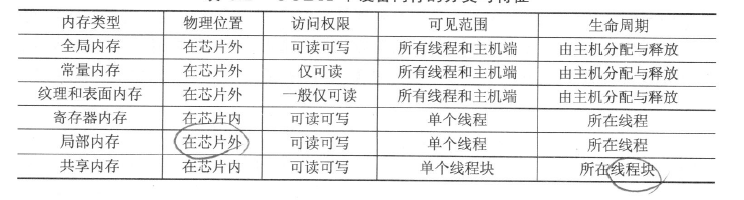
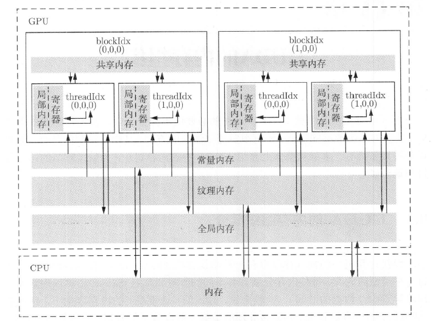
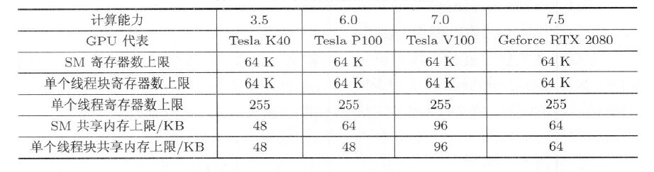

## CUDA 内存组织简介

CUDA 中的设备内存分类和特征：






### 全局内存

“全局内存”（global memory）的含义是核函数中的所有线程都能够访问其中的数据，全局内存由于没有存放在GPU的芯片上，因此具有较高的延迟和较低的访问速度。然而，它的容量是所有设备内存中最大的。其容量基本上就是显存容量。

全局内存的主要角色是为核函数提供数据，并在主机与设备及设备与设备之间传递数据。我们用cudaMalloc()函数为全局内存变量分配设备内存。然后，可以直接在核函数中访问分配的内存，改变其中的数据值。我们说过，要尽量减少主机与设备之间的数据传输，但有时是不可避免的。可以用cudaMemcpy()函数将主机的数据复制到全局内存，或者反过来。

全局内存可读可写。全局内存对整个网格的所有线程可见。也就是说，一个网格的所有线程都可以访问（读或写）传入核函数的设备指针所指向的全局内存中的全部数据。

全局内存的生命周期（lifetime）不是由核函数决定的，而是由主机端决定的。例如生命周期从 cudaMalloc() 开始，到主机端用cudaFree()释放它们的内存结束。在这期间，可以在相同的或不同的核函数中多次访问这些全局内存中的数据。

在处理逻辑上的两维或三维问题时，可以用cudaMallocPitch()和cudaMalloc3D()函数分配内存，用cudaMemcpy2D()和cudaMemcpy3D()复制数据，释放时依然用cudaFree()函数。

以上所有的全局内存都称为线性内存（linear memory）。在CUDA中还有一种内部构造对用户不透明的（not transparent）全局内存，称为CUDA Array。CUDA Array使用英伟达公司不对用户公开的数据排列方式，专为纹理拾取服务。

我们前面介绍的全局内存变量都是动态地分配内存的。在CUDA中允许使用静态全局内存变量，其所占内存数量是在编译期间就确定的。而且，这样的静态全局内存变量，静态全局内存变量必须在所有主机与设备函数外部定义，所以是一种“全局的静态全局内存变量”。这里，第一个“全局”的含义与C++中全局变量的含义相同，指的是对应的变量对从其定义之处开始、一个翻译单元内的所有设备函数直接可见。如果采用所谓的分离编译（separate compiling），还可以将可见范围进一步扩大。


静态全局内存变量由以下方式在任何函数外部定义：

- `_device_- Tx;`   单个变量
- `_device_- Ty[N];` 固定长度的数组


其中，修饰符 `_device_`  说明该变量是设备中的变量，而不是主机中的变量；`T` 是变量的类型；`N` 是一个整型常数。


在核函数中，可直接对静态全局内存变量进行访问，并不需要将它们以参数的形式传给核函数。不可在主机函数中直接访问静态全局内存变量，但可以用 cudaMemcpyToSymbol() 函数和 cudaMemcpyFromSymbol() 函数在静态全局内存与主机内存之间传输数据。这两个CUDA运行时API函数的原型如下：

```
cudaError_t cudaMemcpyToSymbol(

    const void* symbol, // 静态全局内存变量名
    const void* src,     // 主机内存缓冲区指针
    size_t count,        // 复制的字节数
    size_t offset = 0,   // 从symbol对应设备地址开始偏移的字节数
    cudaMemcpyKind kind = cudaMemcpyHostToDevice // 可选参数
);

cudaError_t cudaMemcpyFromSymbol(
    void* dst,          // 主机内存缓冲区指针
    const void* symbol,  // 静态全局内存变量名
    size_t count,        // 复制的字节数
    size_t offset = 0,   // 从symbol对应设备地址开始偏移的字节数
    cudaMemcpyKind kind = cudaMemcpyDeviceToHost // 可选参数
);

```

这两个函数的参数symbol可以是静态全局内存变量的变量名，也可以是下面要介绍的常量内存变量的变量名。

```
#include <cstdio>
#include "error.cuh"

__device__ int d_x = 1;
__device__ int d_y[2];


__global__ void  my_kernel(void)
{
	d_y[0] += d_x;
	d_y[1] += d_x;
	printf("d_x = %d, d_y[0]=%d, d_y[1]=%d\n", d_x, d_y[0], d_y[1]);
}

int main(void)
{
	int h_y[2] = { 10, 20 };
	CUDA_CHECK(cudaMemcpyToSymbol(d_y, h_y, sizeof(int) * 2));
	my_kernel << < 1, 1 >> > ();
	CUDA_CHECK(cudaDeviceSynchronize());

	CUDA_CHECK(cudaMemcpyFromSymbol(h_y, d_y, sizeof(int) * 2));
	printf("h_y[0]:%d, h_y[1]:%d\n", h_y[0], h_y[1]);


	return 0;
}
```

### 常量内存

常量内存（constant memory）是有常量缓存的全局内存，数量有限，仅有 64KB。它的可见范围和生命周期与全局内存一样。不同的是，常量内存仅可读、不可写。由于有缓存，常量内存的访问速度比全局内存高，但得到高访问速度的前提是一个线程束中的线程（一个线程块中相邻的32个线程）要读取相同的常量内存数据。

一个使用常量内存的方法是在核函数外面用 `__constant__` 定义变量，并用前面介绍的 CUDA 运行时 API 函数 `cudaMemcpyToSymbol()` 将数据从主机端复制到设备的常量内存后供核函数使用。当计算能力不小于 2.0 时，给核函数传递的参数（传值，不是像全局变量那样传递指针）就存放在常量内存中，但给核函数传递参数最多只能在一个核函数中使用 4KB 常量内存。

在数组相加的例子中，核函数的参数 `const int N` 就是在主机端定义的变量，并通过传值的方式传送给核函数中的线程使用。在核函数的代码段 `if (n < N)`中，这个参数 `N` 就被每一个线程使用了。所以，核函数中的每一个线程都知道该变量的值，而且对它的访问比对全局内存的访问要快。除给核函数传递单个的变量外，还可以传递结构体，同样也是使用常量内存。结构体中可以定义单个的变量，也可以定义固定长度的数组。


###  纹理内存和表面内存

纹理内存（texture memory）和表面内存（surface memory）类似于常量内存，也是一种具有缓存的全局内存，有相同的可见范围和生命周期，而且一般仅可读（表面内存也可写）。不同的是，纹理内存和表面内存容量更大，而且使用方式和常量内存也不一样。

对于计算能力不小于3.5的GPU来说，将某些只读全局内存数据用 _ldg() 函数通过只读数据缓存（read-only data cache）读取，既可达到使用纹理内存的加速效果，又可使代码简洁。该函数的原型为：

```
T __ldg(constT∗address);
```

其中，`T` 是需要读取的数据的类型；`address`是数据的地址。对帕斯卡架构和更高的架构来说，全局内存的读取在默认情况下就利用了 `_ldg()` 函数，所以不需要明显地使用它。


### 寄存器

在核函数中定义的不加任何限定符的变量一般来说就存放于寄存器（register）中。核函数中定义的不加任何限定符的数组有可能存放于寄存器中，但也有可能存放于局部内存中。另外，以前提到过的各种内建变量，如 `gridDim`、`blockDim`、`blockIdx`、`threadIdx` 及 `warpSize` 都保存在特殊的寄存器中。在核函数中访问这些内建变量是很高效的。


例如：
```
const int n = blockDim.x * blockIdx.x + threadIdx.x;
```
这里的 `n` 就是寄存器中的变量。寄存器可读可写。上述语句的作用就是定义一个寄存器变量n并将赋值号右边计算出来的值赋给它（写入）。

寄存器变量仅仅被一个线程可见。也就是说，每一个线程都有一个变量n的副本。虽然在核函数的代码中用了同一个变量名，但是不同的线程中该寄存器变量的值是可以不同的。每个线程都只能对它的副本进行读写。

寄存器的生命周期也与所属线程的生命周期一致，从定义它开始，到线程消失时结束。

寄存器内存在芯片上（on-chip），是所有内存中访问速度最高的，但是其数量也很有限。

### 局部内存

局部内存和寄存器几乎一样。核函数中定义的不加任何限定符的变量有可能在寄存器中，也有可能在局部内存中。寄存器中放不下的变量，以及索引值不能在编译时就确定的数组，都可能放在局部内存中。这种判断是由编译器自动做的。

虽然局部内存在用法上类似于寄存器，但从硬件来看，局部内存只是全局内存的一部分。所以，局部内存的延迟也很高。每个线程最多能使用高达512KB的局部内存，但使用过多会降低程序的性能。

### 共享内存
共享内存和寄存器类似，存在于芯片上，具有仅次于寄存器的读写速度，数量也有限。


不同于寄存器的是，共享内存对整个线程块可见，其生命周期也与整个线程块一致。也就是说，每个线程块拥有一个共享内存变量的副本。共享内存变量的值在不同的线程块中可以不同。一个线程块中的所有线程都可以访问该线程块的共享内存变量副本，但是不能访问其他线程块的共享内存变量副本。共享内存的主要作用是减少对全局内存的访问，或者改善对全局内存的访问模式。




### L1 和 L2 缓存

从费米架构开始，有了SM层次的L1缓存（一级缓存）和设备（一个设备有多个SM）层次的L2缓存（二级缓存）。它们主要用来缓存全局内存和局部内存的访问，减少延迟。

从硬件的角度来看，开普勒架构中的L1缓存和共享内存使用同一块物理芯片；在麦克斯韦架构和帕斯卡架构中，L1缓存和纹理缓存统一起来，而共享内存是独立的；在伏特架构和图灵架构中，L1缓存、纹理缓存及共享内存三者统一起来。从编程的角度来看，共享内存是可编程的缓存（共享内存的使用完全由用户操控），而L1和L2缓存是不可编程的缓存（用户最多能引导编译器做一些选择）。

对某些架构来说，还可以针对单个核函数或者整个程序改变L1缓存和共享内存的比例。具体地说：

- 计算能力3.5：L1缓存和共享内存共有64KB，可以将共享内存上限设置成16KB、32KB和48KB，其余的归L1缓存。默认情况下有48KB共享内存。
- 计算能力3.7：L1缓存和共享内存共有128KB，可以将共享内存上限设置成80KB、96KB和112KB，其余的归L1缓存。默认情况下有112KB共享内存。
- 麦克斯韦架构和帕斯卡架构不允许调整共享内存的上限。
- 伏特架构：统一的（L1/纹理/共享内存）缓存共有128KB，共享内存上限可调整为0KB、8KB、16KB、32KB、64KB或96KB。
- 图灵架构：统一的（L1/纹理/共享内存）缓存共有96KB，共享内存上限可调整为32KB或64KB。


## SM 及其占有率

### SM 的构成

一个SM包含如下资源：

- 一定数量的寄存器
- 一定数量的共享内存
- 常量内存的缓存
- 纹理和表面内存的缓存
- L1 缓存
- 两个（计算能力6.0）或4个（其他计算能力）线程束调度器（warp scheduler），用于在不同线程的上下文之间迅速地切换，以及为准备就绪的线程束发出执行指令
- 执行核心，包括：
    - 若干整型数运算的核心
    - 若干单精度浮点数运算的核心
    - 若干双精度浮点数运算的核心
    - 若平单精度浮点数超越函数（transcendental functions）的特殊函数单元（special function units, SFUs）
    - 若干混合精度的张量核心（tensor cores，由伏特架构引入，适用于机器学习中的低精度矩阵计算）

### SM 的占有率
因为一个SM中的各种计算资源是有限的，那么有些情况下一个 SM 中驻留的线程数目就有可能达不到理想的最大值。此时，我们说该SM的占有率小于 100%。获得100%的占有率并不是获得高性能的必要或充分条件，但一般来说，要尽量让SM的占有率不小于某个值，如 25%，才有可能获得较高的性能。

当并行规模较小时，有些SM可能就没有被利用，占有率为零。这是导致程序性能低下的原因之一。当并行规模足够大时，也可能得到非100%的占有率。

要分析SM的理论占有率（theoretical occupancy），还需要知道两个指标：

- 一个 SM 中最多能拥有的线程块个数为 Nb=16（开普勒架构和图灵架构）或者 Nb=32（麦克斯韦架构、帕斯卡架构和伏特架构）。
- 一个 SM 中最多能拥有的线程个数为 Nt=2048（从开普勒架构到伏特架构）或者 Nt=1024（图灵架构）。


下面，在并行规模足够大（即核函数执行配置中定义的总线程数足够多）的前提下分几种情况来分析SM的理论占有率：

- 寄存器和共享内存使用量很少的情况。此时，SM 的占有率完全由执行配置中的线程块大小决定：SM中线程的执行是以线程束为单位的，所以最好将线程块大小取为线程束大小（32个线程）的整数倍。例如，假设将线程块大小定义为100，那么一个线程块中将有3个完整的线程束（一共96个线程）和一个不完整的线程束（只有4个线程）。在执行核函数中的指令时，不完整的线程束花的时间和完整的线程束花的时间一样，这就无形中浪费了计算资源。线程块大小不小于128时开普勒架构能获得100%的占有率；线程块大小不小于64时其他架构能获得100%的占有率。

- 有限的寄存器数量对占有率的约束情况。一个SM最多能使用的寄存器个数为64K（64×1024）。除图灵架构外，如果我们希望在一个SM中驻留最多的线程（2048个），核函数中的每个线程最多只能用32个寄存器。当每个线程所用寄存器个数大于64时，SM的占有率将小于50%；当每个线程所用寄存器个数大于128时，SM的占有率将小于25%。对于图灵架构，同样的占有率允许使用更多的寄存器。

- 有限的共享内存对占有率的约束情况。因为共享内存的数量随着计算能力的上升没有显著的变化规律，如果线程块大小为128，那么每个SM要激活16个线程块才能有2048个线程，达到100%的占有率。此时，一个线程块最多能使用3KB的共享内存。在不改变线程块大小的情况下，要达到50%的占有率，一个线程块最多能使用6KB的共享内存；要达到25%的占有率，一个线程块最多能使用12KB的共享内存。如果一个线程块使用了超过48KB的共享内存，会直接导致核函数无法运行。对其他线程块大小可类似地分析。

值得一提的是，用编译器选项 `--ptxas-options=-v` 可以报道每个核函数的寄存器使用数量。CUDA还提供了核函数的 `__launch_bounds__()` 修饰符和 `--maxrregcount=` 编译选项来让用户分别对一个核函数和所有核函数中寄存器的使用数量进行控制。

## 使用 CUDA 运行时函数查询设备

```
#include <cstdio>
#include "error.cuh"


int main(int argc, char* argv[])
{

	int device_id = 0;
	if (argc > 1) {
		device_id = atoi(argv[1]);
	}


	CUDA_CHECK(cudaSetDevice(device_id));

	cudaDeviceProp prop;
	CUDA_CHECK(cudaGetDeviceProperties(&prop, device_id));

	printf("Device id: %d\n", device_id);
	printf("Device name: %s\n", prop.name);
	printf("Compute capability: %d.%d\n", prop.major, prop.minor);
	printf("Amount of global memory: %g GB\n", prop.totalGlobalMem / (1024.0 * 1024 * 1024));
	printf("Amount of constant memory: %g KB\n", prop.totalConstMem / 1024.0);
	printf("Maximum grid size: %d %d %d\n", prop.maxGridSize[0], prop.maxGridSize[1], prop.maxGridSize[2]);
	printf("Maximum block size: %d %d %d\n", prop.maxThreadsDim[0], prop.maxThreadsDim[1], prop.maxThreadsDim[2]);
	printf("Number of SMs: %d\n", prop.multiProcessorCount);
	printf("Maximum amount of shared memory per block: %g KB\n", prop.sharedMemPerBlock / 1024.0);
	printf("Maximum amount of shared memory per SM: %g KB\n", prop.sharedMemPerMultiprocessor / 1024.0);
	printf("Maximum number of registers per block: %d KB\n", prop.regsPerBlock / 1024);
	printf("Maximum number of registers per SM: %d KB\n", prop.regsPerMultiprocessor / 1024);
	printf("Maximum number of threads per block: %d\n", prop.maxThreadsPerBlock);
	printf("Maximum number of threads per SM: %d\n", prop.maxThreadsPerMultiProcessor);


	return 0;
}
```


