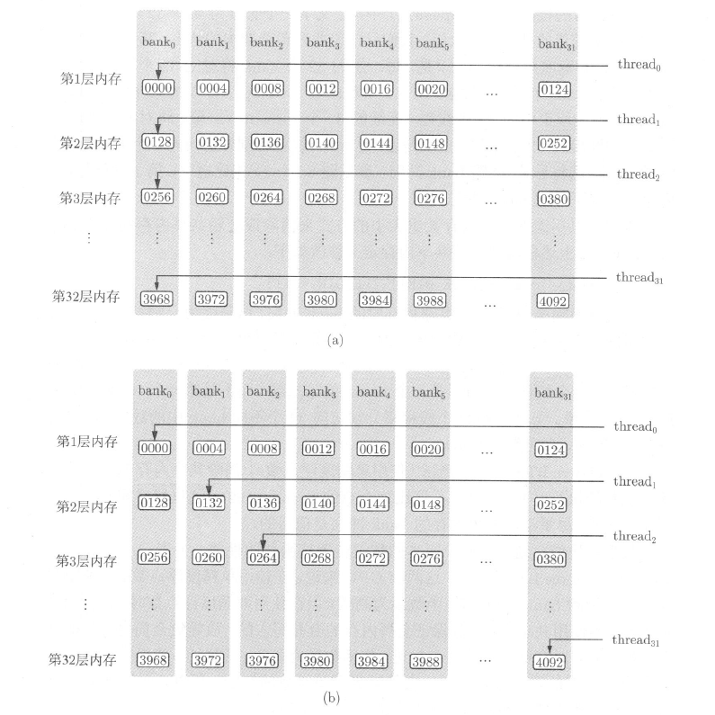

## 数组规约

### 仅使用全局内存
对于数组归约的并行计算问题，我们要从一个数组出发，最终得到一个数。所以，必须使用某种选代方案。假如数组元素个数是2的整数次方（我们稍后会去掉这个假设），我们可以将数组后半部分的各个元素与前半部分对应的数组元素相加。如果重复此过程，最后得到的第一个数组元素就是最初的数组中各个元素的和。这就是所谓的折半归约（binary reduction）法。

```
void __global__ reduce(double *d_x, int N)
{
    int n = blockDim.x * blockIdx.x + threadIdx.x;
    for (int offset = N / 2; offset > 0; offset /= 2)
    {
        if (n < offset)
        {
            d_x[n] += d_x[n + offset];
        }
    }
}
```

要保证核函数中语句的执行顺序与出现顺序一致，就必须使用某种同步机制。在CUDA中，提供了一个同步函数 `__syncthreads()`。该函数只能用在核函数中，并且不带任何参数:
```
__syncthreads();
```
该函数可保证一个线程块中的所有线程（或者说所有线程束）在执行该语句后面的语句之前都完全执行了该语句前面的语句。然而，该函数只是针对同一个线程块中的线程的，不同线程块中线程的执行次序依然是不确定的。

既然函数 `__syncthreads()` 能够同步单个线程块中的线程，那么我们就利用该功能让每个线程块对其中的数组元素进行归约。

```
void __global__ reduce_global(double *d_x, double *d_y)
{
    const int tid = threadIdx.x;
    double *x = d_x + blockDim.x * blockIdx.x;

    for (int offset = blockDim.x >> 1; offset > 0; offset >>= 1)
    {
        if (tid < offset)
        {
            x[tid] += x[tid + offset];
        }
        __syncthreads();
    }

    if (tid == 0)
    {
        d_y[blockIdx.x] = x[0];
    }
}
```

`double *x = d_x + blockDim.x * blockIdx.x;` 也可以写成 `double *x = &d_x[blockDim.x * blockIdx.x];`，这样定义的 `x` 在不同的线程块中指向全局内存中不同的地址，使得我们可以在不同的线程块中对数组 `d_x` 中不同的部分进行归约。具体地说，每一个线程块处理 `blockDim.x` 个数据。

`__syncthreads();` 保证了同一个线程块内的线程按照代码出现的顺序执行指令。至于两个不同线程块中的线程，则不一定按照代码出现的顺序执行指令，但这不影响程序的正确性。这是因为，在该核函数中，每个线程块都处理不同的数据，相互之间没有依赖。总结起来就是说，一个线程块内的线程需要合作，所以需要同步；两个线程块之间不需要合作，所以不需要同步。

该核函数仅仅将一个长度为 `10^8`的数组d_x归约到一个长度为 `10^8/128`的数组d_y。为了计算整个数组元素的和，我们将数组 `d_y` 从设备复制到主机，并在主机继续对数组 `d_y` 归约，得到最终的结果。这样做不是很高效，但我们暂时先这样做。


### 使用共享内存

在上面的核函数中，对全局内存的访问是很频繁的。全局内存的访问速度是所有内存中最低的，应该尽量减少对它的使用。所有设备内存中，寄存器是最高效的，但在需要线程合作的问题中，用仅对单个线程可见的寄存器是不够的。我们需要使用对整个线程块可见的共享内存。

在核函数中，要将一个变量定义为共享内存变量，就要在定义语句中加上一个限定符 `__shared__`。一般情况下，我们需要的是一个长度等于线程块大小的数组。在当前问题中，我们可以定义如下共享内存数组变量：
```
__shared__ double s_y[128];
```
如果没有限定符 `__shared__`，该语句将极有可能定义一个长度为 128 的局部数组。在一个核函数中定义一个共享内存变量，就相当于在每一个线程块中有了一个该变量的副本。每个副本都不一样，虽然它们共用一个变量名。核函数中对共享内存变量的操作都是同时作用在所有的副本上的。

```
void __global__ reduce_shared(double *d_x, double *d_y)
{
    const int tid = threadIdx.x;
    const int bid = blockIdx.x;
    const int n = bid * blockDim.x + tid;
    __shared__ double s_y[128];
    s_y[tid] = (n < N) ? d_x[n] : 0.0;
    __syncthreads();

    for (int offset = blockDim.x >> 1; offset > 0; offset >>= 1)
    {
        if (tid < offset)
        {
            s_y[tid] += s_y[tid + offset];
        }
        __syncthreads();
    }

    if (tid == 0)
    {
        d_y[bid] = s_y[0];
    }
}
```

`s_y[tid] = (n < N) ? d_x[n] : 0.0;` 将全局内存中的数据复制到共享内存中。这里用到了前面说过的共享内存的特征：每个线程块都有一个共享内存变量的副本。其功能展开为：

- 当 `bid` 等于 `0` 时，将全局内存中第 `0` 到 `blockDim.x-1` 个数组元素复制给第 `0` 个线程块的共享内存变量副本。
- 当 `bid` 等于 `1` 时，将全局内存中 `blockDim.x` 到 `2*blockDim.x-1` 个数组元素复制给第 `1` 个线程块的共享内存变量副本。
- 因为这里有 `n < N` 的判断，所以该函数能够处理N不是线程块大小的整数倍的情形。此时，最后一个线程块中与条件 `n >= N` 对应的共享内存数组元素将被赋值为 `0`，不对归约（求和）的结果产生影响。

因为共享内存变量的生命周期仅仅在核函数内，所以必须在核函数结束之前将共享内存中的某些结果保存到全局内存，`if (tid == 0)` 可保证其中的语句在一个线程块中仅被执行一次。该语句的作用可以展开如下：

- 当 `bid` 等于 `0` 时，将第 `0` 个线程块中的 `s_y[0]` 副本复制给 `d_y[0]`；
- 当 `bid` 等于 `1` 时，将第 `1` 个线程块中的 `s_y[0]` 副本复制给 `d_y[1]`；
- 以此类推。

```
void reduce_shared(double *d_x, double *d_y) {
    const int tid = threadIdx.x;
    const int bid = blockIdx.x;
    const int n = bid * blockDim.x + tid;

    // Shared memory array
    __shared__ double s_y[128];

    // Load shared memory with the first element of each thread
    s_y[tid] = (n < N) ? d_x[n] : 0.0;

    // Synchronize threads
    __syncthreads();

    // Perform reduction
    for (int offset = blockDim.x >> 1; offset > 0; offset >>= 1) {
        if (tid < offset) {
            s_y[tid] += s_y[tid + offset];
        }
        __syncthreads();
    }

    // Write the result for this block to d_y
    if (tid == 0) {
        d_y[bid] = s_y[0];
    }
}
```
使用共享内存相对于仅使用全局内存的其他好处:

- 不再要求全局内存数组的长度 N 是线程块大小的整数倍
- 在归约的过程中不会改变全局内存数组中的数据（在仅使用全局内存时，数组d_x中的部分元素被改变）
- 改善全局内存的访问方式（将非合并的全局内存访问转化为合并的）


## 使用动态共享内存

将前一个版本的静态共享内存改成动态共享内存，只需要做以下两处修改：

- 在调用核函数的执行配置中写下第三个参数：
```
<<<grid_size, block_size, sizeof(real) * block_size>>>
```
前两个参数分别是网格大小和线程块大小，第三个参数就是核函数中每个线程块需要的动态共享内存的字节数。

- 要使用动态共享内存，还需要改变核函数中共享内存变量的声明方式:
```
extern __shared__ real s_y;
```
    - 必须加上限定词 `extern`
    - 不能指定数组大小
    - 不能定义成指针形式 `extern __shared__ real *s_y;`，否则编译不过

使用动态共享内存的核函数和使用静态共享内存的核函数在执行时间上几乎没有差别。所以，使用动态共享内存不会影响程序性能，但有时可提高程序的可维护性。

## 使用共享内存实现矩阵转置

```
__global__ void transpose1(const double *A, double *B, const int N)
{
    __shared__ double S[TILE_DIM][TILE_DIM];
    int bx = blockIdx.x * TILE_DIM;
    int by = blockIdx.y * TILE_DIM;

    int nx1 = bx + threadIdx.x;
    int ny1 = by + threadIdx.y;
    if (nx1 < N && ny1 < N)
    {
        S[threadIdx.y][threadIdx.x] = A[ny1 * N + nx1];
    }
    __syncthreads();

    int nx2 = bx + threadIdx.y;
    int ny2 = by + threadIdx.x;
    if (nx2 < N && ny2 < N)
    {
        B[nx2 * N + ny2] = S[threadIdx.x][threadIdx.y];
    }
}
```

- 在矩阵转置的核函数中，最中心的思想是用一个线程块处理一片（tile）矩阵。这里，一片矩阵的行数和列数都是 `TILE_DIM`
- `S[threadIdx.y][threadIdx.x] = A[ny1 * N + nx1];`，将一片矩阵数据从全局内存数组 A 中读出来，存放在共享内存数组中。这里对全局内存的访问是合并的（不考虑内存对齐的因素），因为相邻的 `threadIdx.x` 与全局内存中相邻的数据对应
- 在将共享内存中的数据写入全局内存数组 B 之前，进行一次线程块内的同步操作。一般来说，在利用共享内存中的数据之前，都要进行线程块内的同步操作，以确保共享内存数组中的所有元素都已经更新完毕


## 避免共享内存的 bank 冲突
关于共享内存，有一个内存 `bank` 的概念值得注意。为了获得高的内存带宽，共享内存在物理上被分为32个（刚好等于一个线程束中的线程数目，即内建变量 `warpSize` 的值）同样宽度的、能被同时访问的内存 `bank`。

- 我们可以将32个 `bank`从0~31编号。在每一个 `bank` 中，又可以对其中的内存地址从0开始编号。为了方便起见，我们将所有 `bank` 中编号为0的内存称为第一层内存；将所有 `bank` 中编号为1的内存称为第二层内存
- 在开普勒架构中，每个 `bank` 的宽度为8字节；在所有其他架构中，每个 `bank` 的宽度为4字节

对于 `bank` 宽度为4字节的架构，共享内存数组是按如下方式线性地映射到内存 `bank` 的：共享内存数组中连续的128字节的内容分摊到32个bank的某一层中，每个 `bank` 负责4字节的内容。例如，对一个长度为128的单精度浮点数变量的共享内存数组来说：

- 第0~31个数组元素依次对应到32个bank的第一层
- 第32~63个数组元素依次对应到32个bank的第二层
- 第64~95个数组元素依次对应到32个bank的第三层
- 第96~127个数组元素依次对应到32个bank的第四层

也就是说，每个bank分摊4个在地址上相差128字节的数据：



只要同一线程束内的多个线程不同时访问同一个 `bank` 中不同层的数据，该线程束对共享内存的访问就只需要一次内存事务（memory transaction）。当同一线程束内的多个线程试图访问同一个 `bank` 中不同层的数据时，就会发生 `bank` 冲突。在一个线程束内对同一个`bank` 中的 `n` 层数据同时访问将导致 `n` 次内存事务，称为发生了 `n` 路 `bank` 冲突。最坏的情况是线程束内的32个线程同时访问同一个 `bank` 中32个不同层的地址，这将导致32路 `bank` 冲突。这种 `n` 很大的 `bank` 冲突是要尽量避免的。


```
__global__ void transpose1(const real *A, real *B, const int N)
{
    __shared__ real S[TILE_DIM][TILE_DIM];
    int bx = blockIdx.x * TILE_DIM;
    int by = blockIdx.y * TILE_DIM;

    int nx1 = bx + threadIdx.x;
    int ny1 = by + threadIdx.y;
    if (nx1 < N && ny1 < N)
    {
        S[threadIdx.y][threadIdx.x] = A[ny1 * N + nx1];
    }
    __syncthreads();

    int nx2 = bx + threadIdx.y;
    int ny2 = by + threadIdx.x;
    if (nx2 < N && ny2 < N)
    {
        B[nx2 * N + ny2] = S[threadIdx.x][threadIdx.y];
    }
}
```

定义了一个长度为 `32×32=1024` 的单精度浮点型变量的共享内存数组。我们只讨论非开普勒架构的情形，其中每个共享内存 `bank` 的宽度为4字节。于是，每一层的32个 `bank` 将对应32个连续的数组元素；每个 `bank` 有32层数据。同一个线程束中的32个线程（连续的32个`threadIdx.x`值）将对应共享内存数组s中跨度为32的数据。也就是说，这32个线程将刚好访问同一个 `bank` 中的32个数据。这将导致32路`bank` 冲突。

通常可以用改变共享内存数组大小的方式来消除或减轻共享内存的 `bank` 冲突。例如，将上述核函数中的共享内存定义修改如下：

```
__shared__ real S[TILE_DIM][TILE_DIM + 1];
```
就可以完全消除读取共享内存时的 `bank` 冲突。这是因为，这样改变共享内存数组的大小之后，同一个线程束中的32个线程（连续的32个`threadIdx.x` 值）将对应共享内存数组s中跨度为33的数据。如果第一个线程访问第一个 `bank` 的第一层，第二个线程则会访问第二个 `bank` 的第二层（而不是第一个 `bank` 的第二层）：以此类推。于是，这32个线程将分别访问32个不同bank中的数据，所以没有 `bank` 冲突。


